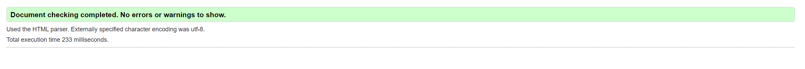
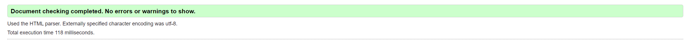
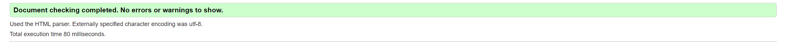
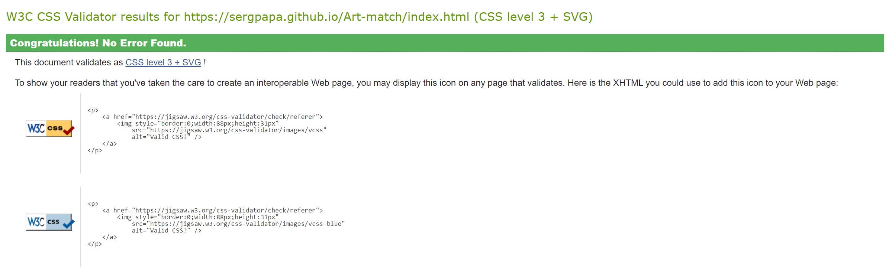
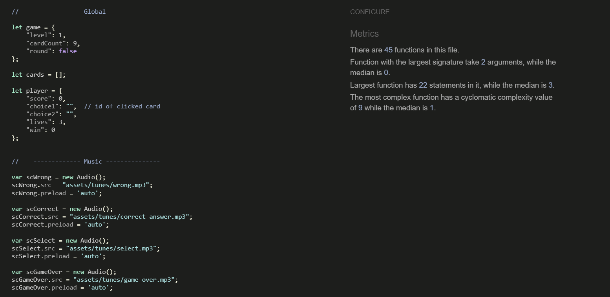
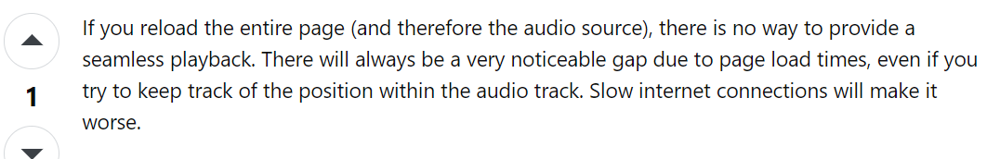
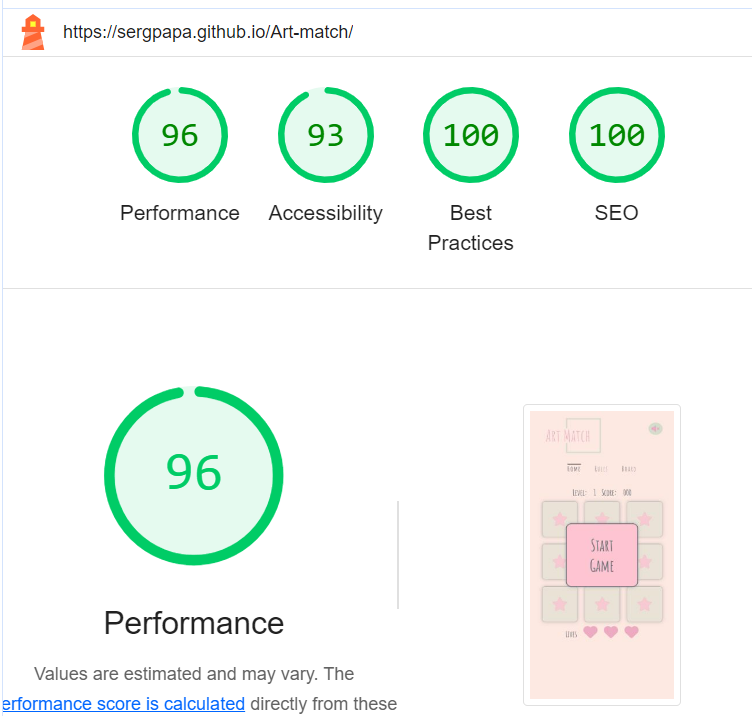

# **TESTING**

The ArtMatch website has been tested manually as well as with automated services like code validators and browser developer tools.

# **Contents**

- [**TESTING**](#testing)
- [**Contents**](#contents)
  - [**Code Validators**](#code-validators)
    - [*w3schools HTML Validator*](#w3schools-html-validator)
    - [*w3schools CSS Validator*](#w3schools-css-validator)
    - [*JsHint JavasScript Validator*](#jshint-javasscript-validator)
  - [**Features Testing**](#features-testing)
  - [**Responsiveness Test**](#responsiveness-test)
  - [**Browser Compatibility**](#browser-compatibility)
  - [**Testing User Stories**](#testing-user-stories)
    - [**As a player, I want**](#as-a-player-i-want)
    - [**As a parent of a minor playing the game, I want**](#as-a-parent-of-a-minor-playing-the-game-i-want)
  - [**Known Bugs**](#known-bugs)
    - [**Resolved**](#resolved)
  - [**Additional Testing**](#additional-testing)
    - [**Lighthouse**](#lighthouse)
  
## **Code Validators**

### *[w3schools HTML Validator](https://validator.w3.org)*

- [Home page](https://sergpapa.github.io/Art-match/)
  
  

- [Rules page](https://sergpapa.github.io/Art-match/rules.html)
  
  

- [Board page](https://sergpapa.github.io/Art-match/board.html)
  
  

### *[w3schools CSS Validator](https://jigsaw.w3.org/css-validator/)*



### *[JsHint JavasScript Validator](https://jshint.com)*



[Back to top](#contents)

## **Features Testing**

- ### Navigation Menu
  
  Expected - Feature is expected to redirect to the various website pages.\
  Testing - Tested the feature by clicking each link manually and examining the result.\
  Result - The feature acted as expected and redirected to other pages

- ### Gameplay features
  
  - *Level Building and Level Progression*
  
    Expected - Feature is expected to keep track of the levels and build new levels when user wins one.\
    Testing - Tested the feature by manually playing the game to check the feature's effectiveness. Additionaly, tested by changing the level count directly through the game.level key on the game object.\
    Result - The feature acted as expected and created levels normally.
  
  - *Card Load and Pairing*
  
    Expected - Feature is expected to connect cards together and load images from the database on their back sides.\
    Testing - Tested the feature manually by checking site response and on Dev Tools by console.log the card pairs and their img elements.\
    Result - The feature acted as expected and connected the cards successfully.

  - *Score Keeping and Leaderboard*
  
    Expected - Feature is expected to keep track of the user's score and update the leaderboard accordinglly.\
    Testing - Tested the feature manually by playing the game and checking score and leaderboard updates.\
    Result - The feature acted as expected and score and leaderboard are displaying normally.

  - *Lives Tracking*
  
    Expected - Feature is expected to keep track of the user's lives and act as a game over trigger.\
    Testing - Tested the feature manually by playing the game and testing if lives are lost if a player makes an error. At 0 health the game is over.\
    Result - The feature acted as expected and lives tracking works successfully.

- ### **Rules**
  
  Expected - Feature is expected to show the rules of the game to the user so they can understand how to play the game.\
  Testing - Tested the feature manually by accessing the rules page.\
  Result - The feature acted as expected and score and the rules are displaying normally.

## **Responsiveness Test**

Responsiveness tests were carried out manually with a combination of device testing and [Google Chrome Developer Tools](https://developer.chrome.com/docs/devtools/).

|         |**iPhone 11**|**Samsung Galaxy S8+**| **Pixel 5**|**iPad Mini**|**iPad Air**|**iPad Pro**|**Display <1200px**|**Display >1200px**|
|---------|-------------|----------------------|------------|-------------|------------|------------|-------------------|-------------------|
|  Render |   Pass      |       Pass           |  Pass      |    Pass     |   Pass     |  Pass      | Pass              |      Pass         |
|  Images |   Pass      |       Pass           |  Pass      |    Pass     |   Pass     |  Pass      | Pass              |      Pass         |
|  Links  |   Pass      |       Pass           |  Pass      |    Pass     |   Pass     |  Pass      | Pass              |      Pass         |

[Back to top](#contents)

## **Browser Compatibility**

ArtMatch has been tested in multiple browsers with no visible issues. Google Chrome, Mozilla Firefox, Safari, Microsoft Edge.Appearance, functionality and responsiveness were found consistent throughout on a range of device sizes and browsers.

[Back to top](#contents)

## **Testing User Stories**

### **As a player, I want**

- intuitive controls that are easily accessible and comprehensible, so that I can have a seamless gaming experience across all devices.
  - *Controls have been designed with simplicity in mind, ensuring easy accessibility (only mouse click is needed).*
  - *Controls are consistent across different platforms, providing a uniform experience.*
- clear and easily understandable game rules, so that I can have a concise overview of how to engage with the game effectively.
  - *Game rules are presented in a concise and user-friendly manner. There is a rules page dedicated to this goal.*
- a user interface with user-friendly buttons and controls designed for effortless navigation, so that I can enjoy the game on various devices.
  - *The user interface is designed with easy navigation in mind. There are three pages always visible in the navigation menu for easy access to all features of the webpage*
  - *Buttons and controls are appropriately sized and placed for optimal usability.*
- an immersive audio-visual experience with captivating sound and visual effects, so that I can enhance my gameplay and receive feedback on in-game events.
  - *Visual messages and/or sound effects are incorporated for an engaging experience.*
  - *Visual and auditory feedback is provided for in-game events and actions.*
- a quick game restart option with a dedicated button, so that I can initiate a new game promptly without unnecessary wait times.
  - *A dedicated button for quick game restart is implemented.*
  - *Restarting the game is a swift and straightforward process.*
- to track my progress with real-time scores, level progression, and mistakes made, so that I can be aware of my performance and game advancement.
  - *Real-time scoring is displayed during gameplay.*
  - *Level progression and mistakes are tracked and visible to the player.*
- informative details about encountered paintings, so that I can gain educational benefits and enhance my art appreciation while playing.
  - *Educational information about each painting is displayed during gameplay.*
- a leaderboard feature to showcase top scores, so that I can be motivated to compete and surpass my own achievements.
  - *A leaderboard is implemented as a dedicated page to display top scores.*
  - *Players can see their own position on the leaderboard.*
  
### **As a parent of a minor playing the game, I want**

- the game to have an educational scope, so that my child can learn about art while playing.
  - *Educational content is age-appropriate and aligned with art appreciation.*
  - *Learning elements are seamlessly integrated into gameplay.*
- a functional and visually appealing game, so that my child can enjoy playing.
  - *The game has a visually appealing design suitable for children.*
- a mute button in the game, so that my child can play without disturbing others with noises.
  - *A mute button is provided to disable in-game sounds.*
  - *Sound settings are easily accessible and visible at all times*
- a game that provides a safe and secure environment for my child to play.
  - *Implement age-appropriate content and features.*

[Back to top](#contents)

## **Known Bugs**

- Sound stops when moving through pages. Based on comments found on [Stack Overflow](https://stackoverflow.com/questions/44629658/audio-continuously-playing-across-all-pages) there is no way to keep ahe playback consistent if the project consists of more than one page.



- Initially the game was meant to be connected to the [Art Institute of Chicago Public API](https://api.artic.edu/docs/) and load random images from there to till the cards. Due to certain difficulties:
  - Loading time of cards was too long (around 15sec) for a simple web game.
  - Error handling was problematic. Many images did not have the required permissions and kept throwing 403 and 404 errors. Attempted to add error handling but it did not seem to work correctly.
  - Images loaded were not always age appropriate. Considering the scope of the project, there was no way of testing for image appropriateness.
  
  For these reasons, the project was decided to not include the API calls but instead work on manually selected images from the Institute witch specified URLs.

### **Resolved**

- Flip cards that were correctly identified, could still be clicked and act as choices for future player moves, which introduced a variety of bugs (score keeping, lives tracking, player moves, won cards being flipped back).
  - The issue was resolved by introducing the clickedCard variable, which targets the card that the player clicked and testing their "won" key. If found false, only then the card can be considered a valid choice and count as a player move.
  
```javascript
$(".flip-card").on("click", function () {
        if (game.round) {
            $(this).children(".flip-card-inner").addClass("flip");

            let clickedCard = cards.find(card => card.id === this.id);

            if (player.choice1 === "" && clickedCard.won === false) {
                playTune(scSelect);
                player.choice1 = this.id;
            } else if (player.choice2 === "" && clickedCard.won === false && player.choice1 !== clickedCard.id) {
                player.choice2 = this.id;
            }

            if (player.choice1 !== "" && player.choice2 !== "") {
                checkPair(player.choice1, player.choice2);
            }
        }
    });
```

[Back to top](#contents)

## **Additional Testing**

### **Lighthouse**

The website has been tested using [Google Lighthouse](https://developer.chrome.com/docs/lighthouse/overview/) to test individual pages on:

- Performance - how does the page perform on loading?
- Accessibility - is the website accessible to all users?
- Best Practices - Does the code follow best practices?
- SEO - Is the pages optimized for search engines?
  
  An example of the Lighthouse results in the FPC home page is shown below:

  

Back to [README.md](./README.md#testing).
